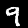
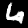

# WGAN-tf2
this project implements the generative model introduced in paper [improved training of wasserstein GANs](https://arxiv.org/abs/1704.00028) with tensorflow 2

## how to get dataset
prepare the dataset with the following command

```bash
python3 download_dataset.py
```

## how to train
train the model with the following command

```bash
python3 train.py
```

## how to convert checkpoint to h5 model
convert with the following command

```bash
python3 save_model.py
```

## how to test
test the generator with the following command

```bash
python3 test.py
```

a pretrained model is enclosed in directory models. test can be conducted on this file directly.
Some samples from the generator is shown here.

<p align="center">
  <table>
    <caption>Samples</caption>
    <tr>
      <td></td>
      <td></td>
      <td></td>
      <td></td>
      <td></td>
    </tr>
    <tr>
      <td></td>
      <td></td>
      <td></td>
      <td></td>
      <td></td>
    </tr>
  </table>
</p>

